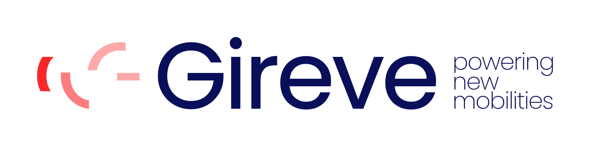

# 1. Introduction

Gireve Trust Platform is a Plug and Charge ecosystem that facilitates the deployment of ISO‑15118 and Plug and Charge by enabling the actors of the ISO‑15118 protocol value chain to generate and manage digital certificates. It simplifies the experience of EV market players while providing a high level of security.  

The Plug aNd Charge Protocol (PNCP) by Gireve is an open protocol that describes the communication rules enabling data transfer and service consumption between an operator’s software platform and the platform of a PKI ecosystem service provider. PNCP covers all Plug and Charge related services (PKI services, V2G Root CA, Certificate Provisioning Service and Pool services). Gireve Trust Platform is accessible using PNCP.

## 1.1 Aims

This document is intended to be a guide to the implementation of the PNCP protocol, with its main use cases as well as its specific implementation within Gireve Trust Platform.

## 1.2 Intended audience

This document is intended for technical teams (system administrators, developers, project managers, etc.) of systems connected or to be connected to Gireve Trust Platform.

## 1.3 Prerequisites

To be able to follow the indications and suggestions given in this implementation guide, it is necessary to have a correct understanding of:

1. PKI and digital certificates.  
2. The basic principles of the ISO‑15118‑2 standard.  

Appendix 1 and Appendix 2 at the end of the guide cover the essential information needed on these two points. Knowledge of the OCPI protocol is useful but not essential; OCPI documentation is available at <https://github.com/ocpi/ocpi>.

## 1.4 Document layout

This document is in two parts:

- A **technical part**, describing security, platform authentication and identification mechanisms, as well as other parameters to be considered when establishing HTTP calls to Gireve Trust Platform.  
- A **functional part**, describing the different workflows and services to be implemented by each actor using the platform and the specific rules applied to each of the services presented by Gireve.  

In this repository, these parts are distributed across the Markdown files under `docs/`, in particular `02-technical-guidelines.md` and `03-functional-guidelines.md`.

## 1.5 Definitions and abbreviations

The following table lists the main terms and abbreviations used in this guide.

| Term                               | Definition                                                                                                                                                                                                                                                                                                                                                                                                         | Synonym                                                                                      |
| ---------------------------------- | ------------------------------------------------------------------------------------------------------------------------------------------------------------------------------------------------------------------------------------------------------------------------------------------------------------------------------------------------------------------------------------------------------------------ | -------------------------------------------------------------------------------------------- |
| OEM                                | OEM stands for "Original Equipment Manufacturer" which is an ambiguous term. In the context of this document, it represents the EV Maker, and thus the actor that designs (engineering) and produces (plant) the EV. This actor is supposed to be able to define the configuration of the vehicle when released from the factory, and to manage the communication link from and to the vehicle.                    | Car Maker                                                                                    |
| Contract Certificate               | The contract certificate is an X509 certificate that authenticates the eMSP contract, that will be used to pay the charging sessions. This certificate is issued on behalf the eMSP and must be installed into the EV. It will be used for the charging session authentication step. The Common Name (CN) of this certificate contains the eMAId of the contract.                                                  | CC                                                                                           |
| Contract Certificate Bundle        | The "contract certificate bundle" is defined by the ISO-15118 norm. It is an information package enabling the installation of a contract certificate in a specific vehicle. It contains: the contract certificate, its certification chain, the contract certificate's (CC) private key encrypted with the vehicle's provisioning certificate public key and the DHPublicKey needed to decrypt the CC private key. | CCB                                                                                          |
| Signed Contract Certificate Bundle | The "contract certificate bundle" is defined by the ISO-15118 norm. It contains the CCB, a signature and a CPS certificate with its certification chain. The vehicle must verify the signature and the CPS certification chain before installing the contract certificate with the CCB.                                                                                                                            | SCCB                                                                                         |
| Provisioning Certificate           | The provisioning certificate is an X509 certificate that authenticates the EV, typically during the process of Contract Certificate Provisioning. This certificate is issued on behalf the OEM (of the EV) and must be installed into the EV. The Common Name (CN) of this certificate contains the PCID of the EV.                                                                                                | PC                                                                                           |
| Vehicle Certificate                | The vehicle certificate is an X509 certificate that authenticates the EV, typically during the Vehicle to Charging-station data-link establishment (mutual authentication). This certificate is issued on behalf the OEM (of the EV) and must be installed into the EV. This certificate is only used in ISO-15118-20.                                                                                             | VC                                                                                           |
| CPO                                | CPO stands for Charging Point Operator. The CPO is the system actor that manages Charging Points. CPO designates the actor and its information system. The CPO Back-end system is supposed to be connected to the Charging Stations it manages, and to be able to exchange information and data with them.                                                                                                         | CSO (Charging Station Operator)                                                              |
| eMSP                               | eMSP stands for e-Mobility Services Provider. The eMSP is the system actor that offers services to the customers, and typically the EV Charging services. The customer is supposed to be a customer of an eMSP and to have an account with the eMSP. This account is identified by the eMAId.                                                                                                                      | MO (Mobility Operator), MSP (Mobility Services Provider), EMP (e-Mobility services Provider) |
| CPS                                | CPS stands for Certificate Provisioning Service. Entity in charge of facilitating the installation of a new contract certificate for an EV with a digital signature.                                                                                                                                                                                                                                               |                                                                                              |
| CCP                                | CCP stands for Contract Certificates Pool. CCP is a data exchange and communication facility, on which the asynchronous (and synchronous) exchanges of Contract Certificates between actors (eMSP, OEM, CPO) are based.                                                                                                                                                                                            |                                                                                              |
| PCP                                | PCP stands for Provisioning Certificates Pool. PCP is a data exchange and communication facility, on which the asynchronous (and synchronous) exchanges of Provisioning Certificates between actors (eMSP, OEM) are based.                                                                                                                                                                                         |                                                                                              |
| RCP                                | RCP stands for Root Certificates Pool. RCP is a data exchange and communication facility, on which the asynchronous (and synchronous) exchanges of RootCA Certificates between actors are based.                                                                                                                                                                                                                   |                                                                                              |
| EV                                 | EV stands for electric vehicle. There is no restriction about the nature of this EV. It could be a car, a bus, a truck, a motorcycle...                                                                                                                                                                                                                                                                            | EVCC (electro vehicle communication controller)                                              |
| SECC Certificate                   | The SECC certificate is an X509 certificate that authenticates the Charging Station, typically during the Vehicle to Charging-station data-link establishment. This certificate must be installed into the SECC. The Common Name (CN) of this certificate contains the CPID of the SECC.                                                                                                                           | EVSE Certificate, Charging Point Certificate, Charging Station Certificate                   |
| SECC                               | SECC stands for Supply Equipment Communication Controller. The SECC is the ISO-15118 communication part of the Charging Station that communicates with the EV. There is only one SECC per Charging Point, but several Charging Point could share the same SECC.                                                                                                                                                    |                                                                                              |
| eMAId                              | eMAId stands for E-Mobility Account Identifier. This is the identifier of the account that the customer has with its eMSP.                                                                                                                                                                                                                                                                                         |                                                                                              |
| EVSE                               | EVSE stands for Electric Vehicle Supply Equipment. The EVSE is the electric part of a charging station that manages the delivery of energy to the vehicle. The Charging Point is the ability of a Charging Station to charge one vehicle at a time. Because there is one EVSE per Charging Point and one Charging Point per EVSE, both nouns are synonym.                                                          | Charging Point                                                                               |
| PCID                               | PCID stands for Provisioning Certificate Identifier. The PCID is an identifier of the EV.                                                                                                                                                                                                                                                                                                                          |                                                                                              |
| EV-Driver                          | The EV-Driver is the system actor which uses the EV. EV-Driver, EV-User and Customer are three separated roles that could be played by three or two separated actors or by the same one.                                                                                                                                                                                                                           |                                                                                              |
| EV-Owner                           | The EV-Owner is the system actor which owns the EV. EV-Driver, EV-User and Customer are three separated roles that could be played by three or two separated actors or by the same one.                                                                                                                                                                                                                            |                                                                                              |
| Customer                           | The Customer is the system actor, which is the customer of the eMSP, and which will pay the charging services. EV-Driver, EV-User and Customer are three separated roles that could be played by three or two separated actors or by the same one.                                                                                                                                                                 |                                                                                              |
| Certification Authority            | A certification authority is an actor in charge of delivering PKI services such as: generation and delivery of certificates, certificate revocation, certificate revocation status publication. It represents the actor and the information system.                                                                                                                                                                | CA                                                                                           |
| OCSP Responder                     | The OCSP Responder is a service in charge of providing revocation status of certificates. It follows the Online Certificate Status Protocol, and creates signed response based on the original CA certificate revocation status publication that it has permission to manage the OCSP for.                                                                                                                         |                                                                                              |
| OCSP Stapling                      | OCSP Stapling is a mean for a server to provide his certificate revocation status, associated ("stapled") to its own certificate, as a mean to prevent multiple calls to the OCSP Responder by all clients.                                                                                                                                                                                                        |                                                                                              |
| Root CA                            | A Root Certification Authority is a certification authority that is the root of a PKI hierarchy. It needs to be trusted by all bearers of certificates and by all the parties that will check those certificates. It is represented as a self-signed X509 certificate.                                                                                                                                             | RCA                                                                                          |
| Sub CA                             | A Sub Certification Authority is a certification authority able to deliver certificates with a trust delegated from a Root CA. There are 2 levels of Sub CA defined for ISO ISO-15118. It is represented by a X509 certificate signed by its delivering CA which can be a Root CA or a Sub CA.                                                                                                                     | SCA                                                                                          |
| Trust List of Root CA              | The trust list of Root CA is the list of Root Certification Authority that are trusted in the whole system. That trust list is a signed list of all the Root Certification Authority certificates or their fingerprints.                                                                                                                                                                                           | CA TL, TL of RCA, Trust Anchors                                                              |
